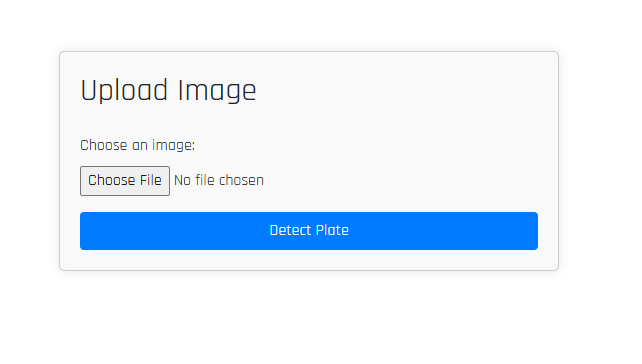
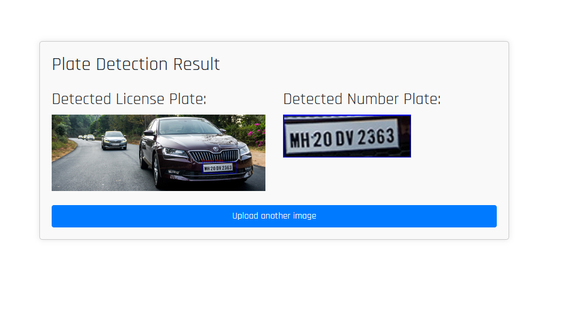

# Number Plate Detection using Django

## Overview

This project implements a number plate detection system using Django, aimed at identifying and highlighting license plates in images. It utilizes OpenCV for image processing and Django for web framework integration, providing a user-friendly interface for uploading images and displaying detection results.

## Features

- **License Plate Detection**: Utilizes Haar Cascade classifier to detect license plates in images.
- **Web Interface**: Built with Django framework, allowing users to upload images and view detection results.
- **Interactive Display**: Displays detected license plates with bounding boxes and provides an option to download the cropped number plate images.





## Tools and Technologies Used

- **Python**: Programming language used for backend processing.
- **Django**: Web framework for building the application's frontend and backend.
- **OpenCV**: Image processing library for detecting license plates.
- **Bootstrap**: Frontend framework for styling the user interface.
- **HTML/CSS**: Used for structuring and styling web pages.

## Installation

To run this project locally, follow these steps:

1. Clone the repository:
```
git clone https://github.com/nishansr/django-number-plate-detection.git
cd django-number-plate-detection
```
2. Install the required Python dependencies:

```python
pip install -r requirements.txt
```
3. Run the Django development server:
``` python
python manage.py runserver
```


4. Open your web browser and go to `http://localhost:8000` to view the application.

## Usage

1. Upload an image containing a license plate using the provided interface.
2. Click on "Detect Plate" to initiate the detection process.
3. View the detected license plate highlighted with a bounding box.
4. Optionally, download the cropped image of the detected number plate.

## Contributing

Contributions are welcome! Please fork the repository and submit a pull request with your improvements.


## Acknowledgments

- This project was inspired by the need for automated license plate detection systems.
- Special thanks to the developers of OpenCV and Django for their powerful libraries and frameworks.
